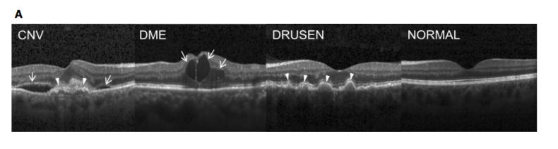

# Resnet18_OCT

微调ResNet18实现的眼角膜OCT图像识别，选用Kaggle开源数据集[Retinal OCT Images](https://www.kaggle.com/datasets/paultimothymooney/kermany2018 "Retinal OCT Images")

已实现flask框架搭建，详见[app.py](./app.py)

测试集准确率99.7%模型附在[此处](https://pan.baidu.com/s/1jZwjOzJloDACgnLMq9m_aQ)，提取码：n2dr，修改路径即可一键调用
